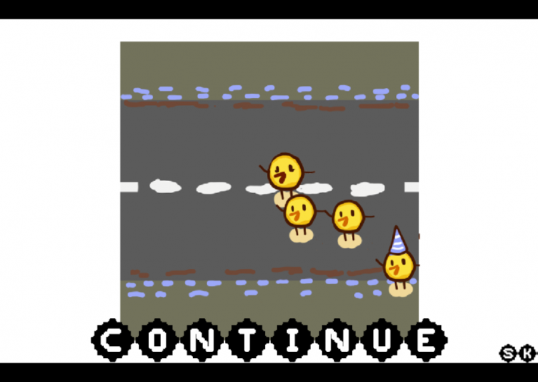
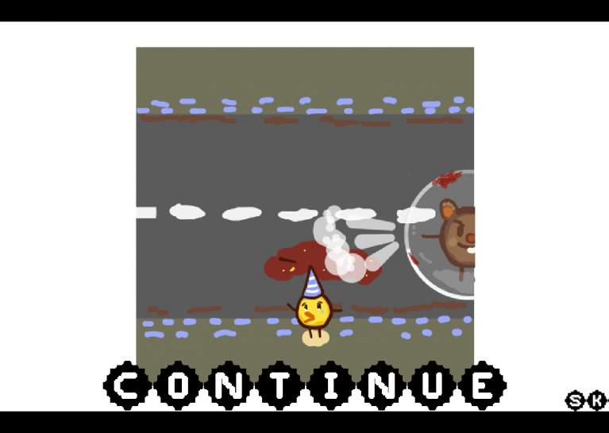
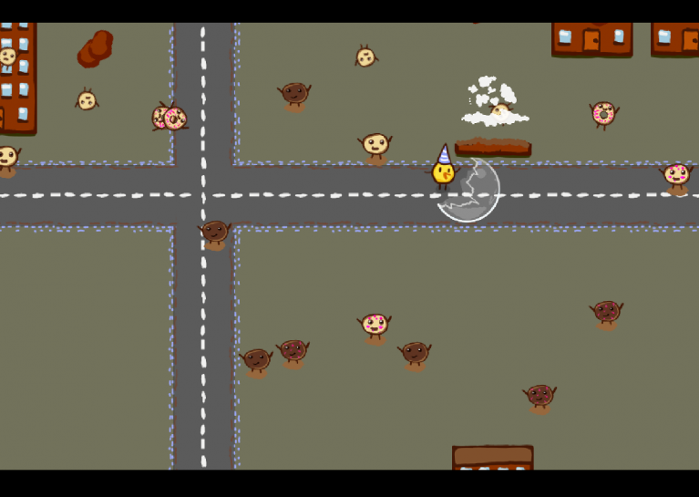
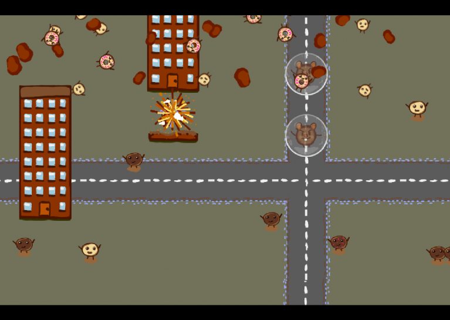
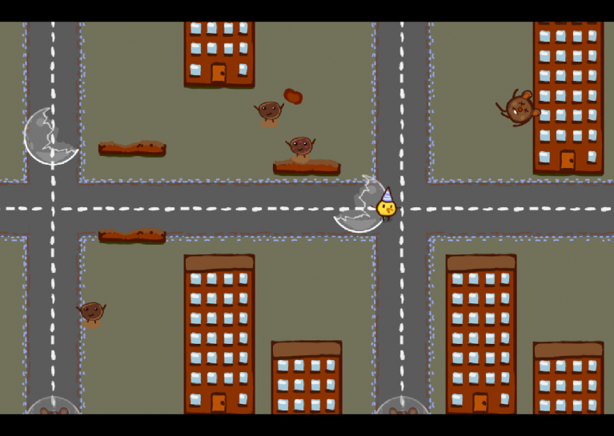

DUCKSTRUCTION
=============

Global Game Jam 2015

Theme: "What do we do now?"

How to build it
---------------

 1. [Download and install haxe.](http://haxe.org/documentation/introduction/building-haxe.html)

 2. Install lime and openfl:

        haxelib install lime
        haxelib run lime setup
        lime install openfl

 3. Install HaxeFlixel and its dependencies using lime:

        lime install flixel

 4. Go to the project directory and run:

        lime test flash

        lime test linux

        lime test windows

        lime test android

<!---
Idea
----

 * Story: Duck with children crosses street, gets hit by car
 * Duck gets angry
 * Player plays duck destroying a city
 * When city is fully destroyed:
   "What do we do now?"
 * Game starts over
-->

Team
----

 * Rebekka "pixie" Helzle
 * Till "fox" Behrend
 * Andreas "monoton" Drechsler
 * Rick "tinyworlds" Hoppmann
 * Silvio "evolutier" Müller
 * Oliver "oz" Zeit
